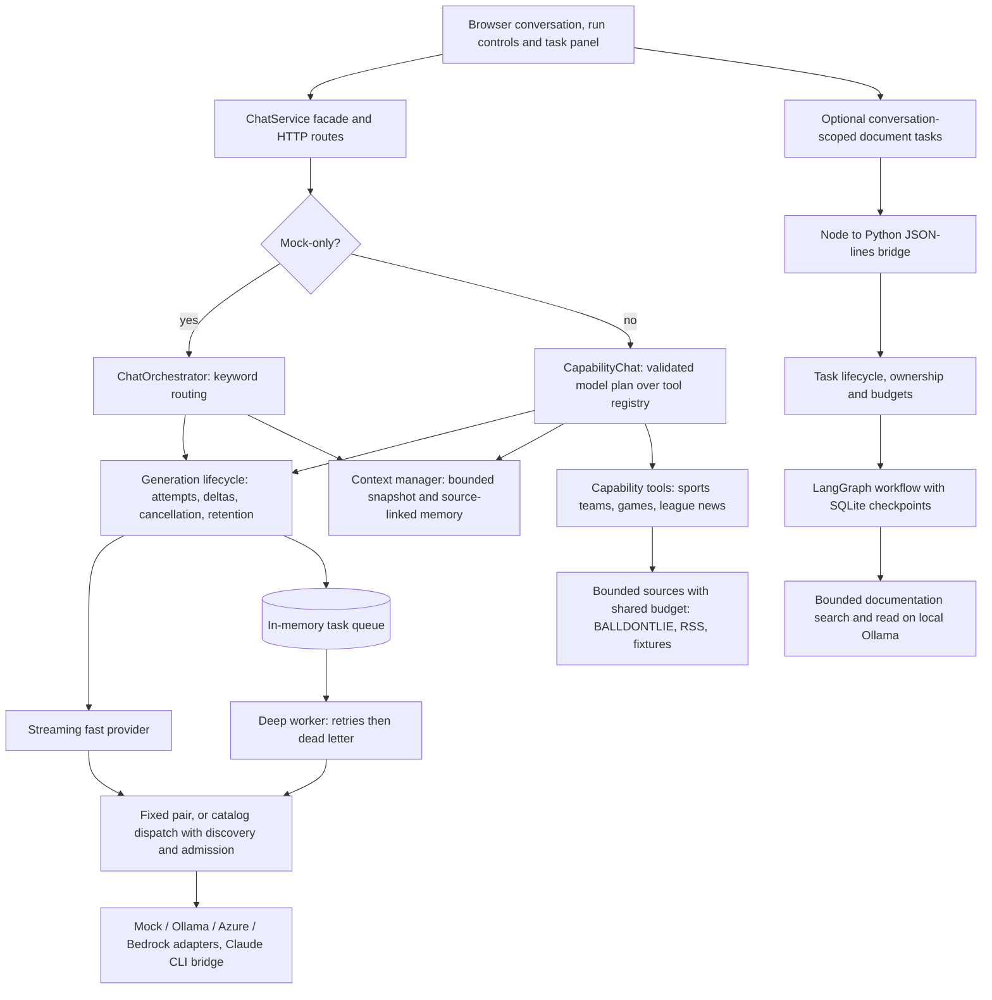

# ChatAgent — responsive chat and background AI workflows

ChatAgent explores how an AI assistant can keep a conversation available while
background agents retrieve evidence and execute bounded work. It combines streaming
chat, cancellation, context management, and a LangChain documentation agent with
LangGraph checkpointed execution.

Built by [Justin M Russas](https://github.com/JMRussas). This is a working local
engineering prototype with reproducible experiments, not a hosted production
service. The GitHub repository and internal package retain the name **ChatRuntime**.
No sibling repository or private project is required to run it.

**Start here:** [Engineering case study](docs/portfolio-case-study.md) ·
[Results and evidence](docs/results.md) · [Demo walkthrough](docs/07-demo-script.md) ·
[Run locally](#run-locally)

## What it demonstrates

- **Responsive interaction:** streamed foreground answers and asynchronous deep
  follow-ups, with visible progress, cancellation and explicit incomplete outcomes.
- **Bounded agent execution:** a Python/LangChain agent searches and reads repository
  documentation; host code enforces tool, retrieval and model-call limits.
- **Durable task boundaries:** LangGraph and SQLite preserve confirmed checkpoints.
  Independent tasks support status, cancellation and resume; uncertain in-flight
  execution is refused rather than automatically replayed.
- **Context engineering:** bounded conversation snapshots and background source-linked
  memory; original transcript records remain intact. Completed documentation tasks
  appear separately and are not automatically inserted into model context.
- **Evidence-based decisions:** controlled prompt experiments, lifecycle fault
  injection and real local-model contention measurements inform the design.

## Task-based model dispatch

`MODEL_ROUTING_MODE=fixed` preserves the configured fast/deep pair. Opt into
`catalog` with curated limits, fresh discovery and a local resource policy to select
bindings by task, retained context, matching evaluations and configured priority.
Selections and fallback reasons appear on each turn; `/telemetry/dispatch` separates
fast/deep attempt records and reservation states. See
[configuration and limits](docs/implementation/04-dispatch.md#configuration) and
[offline acceptance evidence](docs/implementation/04-evidence.md).

## Selected results

Measurements are dated **September 2026**. Each link includes methods and limits.

| Question                                         | Evidence                                                                                                                                                                                                                                                                                                                                       | Decision                                                                                       |
| ------------------------------------------------ | ---------------------------------------------------------------------------------------------------------------------------------------------------------------------------------------------------------------------------------------------------------------------------------------------------------------------------------------------- | ---------------------------------------------------------------------------------------------- |
| Does prompt structure help consistently?         | [600 scored Ollama calls](reports/prompt-contract/findings-2026-09-26.md): five model digests × 24 cases × five conditions. On held-out cases, headings scored 40/60 versus 38/60 for identical flat text.                                                                                                                                     | Keep renderers configurable; a two-answer difference does not establish a universal advantage. |
| Does foreground priority improve responsiveness? | [Controlled local pilot](reports/doc-agent/contention-findings-2026-09-28.md): overlap first-answer medians of **477 ms concurrent, 479 ms FIFO, 569 ms priority**, six samples per policy. **18/18** noncancelled background tasks completed.                                                                                                 | Keep production scheduling unchanged; the candidate did not demonstrate a benefit.             |
| Are failure boundaries exercised?                | [Local verification](reports/doc-agent/contention-v2-2026-09-28/release-check.txt): **258 TypeScript tests**; [Python verification](reports/doc-agent/contention-v2-2026-09-28/python-check.txt): **61 agent/lifecycle tests**. [Fault review](reports/doc-agent/lifecycle-edge-cases-2026-09-27.md) reproduced and fixed five lifecycle gaps. | Test cancellation races, deadlines, persistence failures and process death explicitly.         |

Live model measurements, deterministic software tests and simulated release checks
are separate evidence. Test counts do not measure model accuracy; these small local
latency samples are not a production SLA. See the [evidence guide](docs/results.md).

## Architecture



A class-level map with eight diagrams is in [docs/10-class-map.html](docs/10-class-map.html).

The documentation agent is an explicit optional action. The bridge admits up to
eight scheduled documentation tasks and runs one at a time; foreground chat uses
its own path. Shared inference scheduling is experimental, not enabled by default.
Conversation history remains in memory; documentation checkpoints are durable.

## NBA briefing prototype

The next demo is a personalized league/team briefing with background work and
source-backed follow-ups. The first slice plans tasks offline:

```bash
npm run sports:plan -- data/nba-briefing-request.example.json
```

Pass an optional second argument to select a custom briefing profile; the default
is `data/sports/nba-profile.example.json`. Windows, tasks and source budgets are
configurable. This fixed-time example fetches no live data and asks for a team selection. See the
[demo plan](docs/18-nba-briefing-demo.md) for implemented scope and next steps. Run
`npm run sports:fixture -- data/sports/briefing-request.fixture.json` to collect
fictional evidence through the coordinator; this does not fetch live NBA data.
NFL is also supported via `npm run sports:nfl -- 168` and the configurable
`data/sports/nfl-games-profile.example.json`. Existing-key NFL access was verified
with one request; live briefing/UI integration remains separate.
For a public RSS news read, use
`npm run sports:news -- data/sports/espn-nfl-rss.example.json 24`.
Feed scope and fetch bounds are configurable. Articles preserve publisher attribution
and original links; RSS coverage/freshness remain partial/unknown, so exit 1 is expected.
This command does not use BALLDONTLIE quota.
To enable live background briefings, set
`SPORTS_BRIEFING_CONFIG_PATH=data/sports/nfl-live-briefing.example.json` and restart.
Use the [start/status/cancel HTTP commands](docs/runtime-reference.md#optional-sports-briefing-http-boundary)
to collect games and news. Startup performs no sports requests; live chat uses a model-produced plan and the configured tool registry to
clarify requests, report missing capabilities or collect background evidence. The shared games budget allows five starts per rolling minute, including bursts.
Further requests fail fast until capacity returns; cached reads remain available.
After editing that configuration file, `POST /briefings/config/reload` with `{}`
applies validated changes without restarting. New runs record the configuration
version; existing work and service request history survive reload. The API key and
configuration-file path still require a restart to change.
An explicit `npm run sports:games -- 24` command prepares the BALLDONTLIE games
path using `BALLDONTLIE_API_KEY` from local configuration. No key is bundled; partial
coverage and unknown freshness remain visible. See the demo plan before live use.

## Run locally

Use Node **24.21.0**, pinned in `.node-version` for development and CI.
The [runtime evaluation](docs/12-development-roadmap.md#runtime-baseline-evaluation-2026-10-01)
records the compatibility checks and support timeline behind this choice.
The dependency engine range is broader than this tested baseline. Windows Node
24.15.0 has a reproduced native HTTP/fetch crash (`0xc0000409`); the test config
rejects that runtime with an actionable error before starting any workers.
With no provider overrides, the application uses **mock providers**, so this first
run needs no cloud credentials, Python environment or model download:

```bash
npm ci
npm test
npm run dev
```

Open **http://localhost:3100/**. Mock replies demonstrate the interaction and
lifecycle, not live model quality. Existing environment variables or a local `.env`
can override defaults; [.env.example](.env.example) documents the settings.

For live documentation retrieval, install the Python dependencies and enable the
optional worker using the [self-contained setup guide](docs/implementation/11-conversation-tasks.md#enable-and-use).
The published live runs used locally installed `gemma4:26b`; it is not downloaded
automatically. Node and Python must run on the same OS.

Further commands and API details: [runtime reference](docs/runtime-reference.md).

Conversation history is process-local and bounded. `CONVERSATION_*` settings in
`.env.example` configure history count, idle expiry, event/byte limits and lifetime
identity capacity; changes require a restart. Expired conversations return 410 and
require a new conversation ID. Running/queued work protects its history. Expired
IDs retain ownership tombstones and are never recycled automatically: exhausting
that configured capacity returns 503 for new conversations until an operator
retires expired identities (`GET /conversations/retention`,
`DELETE /conversations/<id>/identity`). A retired ID is unknown to the process, so
reusing it starts an unrelated conversation. The page explains expiry and offers a
new conversation. History overflow
returns 413. Each history also reserves at most `CONVERSATION_MAX_EVENTS` compact
emergency terminal records (at most 1 KiB each), so reaching the normal event/byte
limit can still publish a failure. This reserve is additional to the normal history
limits; exhausted attempt reservations reject new generations. Streams opened before
submission and unknown cancellation requests do not reserve identities.
Dead letters are bounded by admission, not expiry. `DEAD_LETTER_*` settings cap
failed-task records together with the slots reserved by queued, running and
replayed deep tasks, so a failure always has room to be recorded. Records are
never evicted; they leave by replay or explicit discard. A full store returns 503
`DEAD_LETTER_CAPACITY` for new deep-routed messages until an operator acts.
Catalog admission tracks at most `ADMISSION_MAX_QUOTA_POOLS` distinct quota pools.
Consumed pool totals are never evicted; a further pool ID is excluded with
`QUOTA_POOL_CAPACITY` ([details](docs/implementation/04-dispatch.md#configuration)).

`npm run bench:sustained-memory` drives both assembled runtimes past these limits
and asserts every retained registry; see the roadmap for its scope, evidence and
the remaining durable-retention work.

To diagnose HTTP worker exits independently of the application and Vitest, run
`npm run diagnose:http` (25 isolated processes), or
`npm run diagnose:http -- 100`. It stops on the first failure and reports the
runtime, native exit code and last reported phase. It uses only loopback HTTP,
does not read `.env`, and does not retry failed runs. Avoid running multiple large
stress batches together: Windows temporary TCP ports can be exhausted, producing
ordinary `EADDRINUSE`/`ETIMEDOUT` connection errors distinct from a native crash.

## Development formatting

Run `npm run format` after edits and `npm run lint` before committing. The pinned
Prettier configuration covers supported source, tests, configuration and docs;
`.prettierignore` excludes generated evidence and local review files. Python
formatting is separate. CI checks formatting through `verify:release`.

To omit the mechanical formatting commit from local blame output:

```bash
git config blame.ignoreRevsFile .git-blame-ignore-revs
```

See [repository conventions](AGENTS.md) for maintenance and commit conventions.

## Scope and next work

This prototype has no built-in authentication or production deployment hardening.
Conversation ownership checks are not authentication. Source IDs and valid output
schemas do not establish that every answer claim is supported by its citation.
Provider adapters exist for Azure and Bedrock, but the linked agent and contention
results are local Ollama measurements.

As of 2026-09-29, active development resumed on the numbered runtime spec
(spec 03 — provider discovery/inventory); the documentation-agent/learning
track referenced below is parked, not the active priority. Automatic
task-result insertion, timed triggers and automatic learning are not
implemented. Older planning documents are historical where they conflict with
this overview; the [current roadmap](docs/12-development-roadmap.md) tracks sequencing.

## Explore the engineering

- [Case study: architecture, tradeoffs and AI-assisted development](docs/portfolio-case-study.md)
- [Evidence guide: results, limitations and reproduction](docs/results.md)
- [LangChain agent and LangGraph learning slice](experiments/doc-agent/README.md)
- [Task lifecycle and cancellation](experiments/doc-agent/TASKS.md)
- [Durability and fail-closed recovery](experiments/doc-agent/DURABILITY.md)
- [Conversation context and memory evidence](docs/implementation/01b-evidence.md)
- [CI workflow](.github/workflows/verify.yml): TypeScript checks and simulated regression gates; live Ollama and Python evaluations run separately.

Live chat planning uses strict validated JSON and bounded original conversation history.
The default mock-only demo retains the legacy simulated pipeline. Low output-token
limits can truncate plans; increase `CHAT_FAST_MAX_OUTPUT_TOKENS` (or the overriding
`OLLAMA_FAST_NUM_PREDICT`) if `CAPABILITY_PLAN_TRUNCATED` occurs. The live Ollama smoke
check used 1024 output tokens. No generic web search or MLB adapter is connected.

Retained-state bounds also cover queued task count/bytes, aggregate tool-result
bytes, completed answer buffers, coalesced telemetry saves and discovery churn.
[Runtime contracts](docs/runtime-reference.md#remaining-retained-state-bounds)
describe overflow, cancellation and snapshot replacement semantics; `.env.example`
lists the limits. The sustained-memory gate includes separate scripted discovery
and stalled file-write workloads, without live provider calls.
