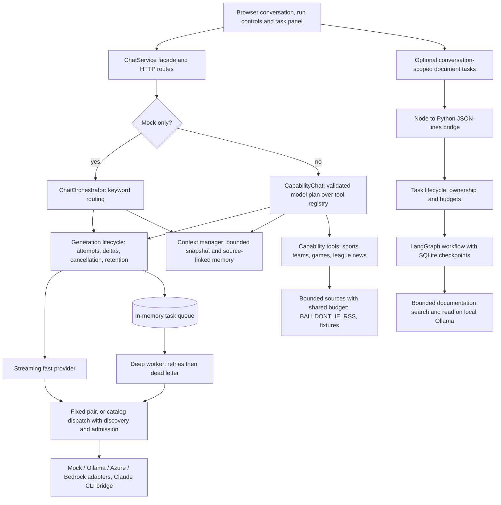

# ChatAgent — responsive chat and background AI workflows

The home page is a Workspace with projects in the sidebar and separate Work and
Conversations views. Register existing repositories, browse saved conversations
and project work, continue a thread, or open and run a plan in the same page.
Conversations have editable titles, project assignments and an archive control.
Opening or refreshing records performs no execution. History and navigation
metadata are saved by default in `data/conversations.json` and
`data/workspace.json`; `CONVERSATION_STATE_FILE` and `WORKSPACE_STATE_FILE`
override those locations. `WORKSPACE_ENABLED=false` disables the workspace.

Open `/design` for the proposed workspace layout using the same authenticated
project, conversation and work records. This reference preview only reads data;
use the home page for live chat, project management and plan execution.

Bind a project to its existing Hekate project in **Project integration** to
discover its workflows and coding plans. `WORKFLOW_PROJECT_ID` remains an optional
default binding. Conversation actions use the conversation's assigned project
unless an explicit project is supplied. Existing Hekate bindings cannot be
replaced; register another project to keep active work and its history intact.
The catalog covers registered projects and conversations saved by this app.
External CLI/IDE histories require an importer or connection. A repository path
registers a project; coding execution still uses the configured prepared-plan host.

The Plans panel supports opening, creating and editing JSON workflows, running
them, inspecting step inputs/results, stopping work and supplying human results.
UI controls, conversation actions and MCP clients use the same application tools.
Steps may invoke registered tools/APIs, call the configured model or wait for input.
An agent step supplies an objective, context, references, selected tools and
completion criteria to a configured native executor. The Plans panel's **New agent
task** form creates that step without editing JSON. Its activity shows actual tool
calls and results; missing context or tool access pauses for a visible response.

The creator describes the configured workflow model policy: a fixed provider/model,
selection from the catalog at execution, unavailable execution, or an unknown
identity for a custom adapter. `list_actions` exposes this as `model` metadata;
discovery never invokes the provider. The chat model picker does not select the
workflow model. Recorded steps show provider/model only when their saved output
contains that identity. Agent tool choices remain explicit grants; discovering a
tool does not authorize its use.

Continuing a conversation shows its most actionable linked work item, with other
items available in an expandable list. “Currently open” describes the displayed
thread; “No reply in progress” describes its recorded reply state. Reviewing linked
work does not submit a response or execute a plan.

To enable workflow execution, configure the Hekate PlanStore API and an optional default project:

```dotenv
HEKATE_PLAN_API_URL=http://127.0.0.1:5111
WORKFLOW_PROJECT_ID=<existing-project-uuid>
WORKFLOW_RUN_DIR=data/workflow-runs
WORKFLOW_HTTP_ENDPOINTS_JSON={"fetch_report":"https://your-api.example/report"}
CONVERSATION_STATE_FILE=data/conversations.json
```

Copy [the example definition](data/workflows/fetch-review.example.json) into a new
plan, configure its API endpoint and select a real model through the existing
provider settings. API actions use operator-configured endpoints; plans do not
supply arbitrary executable code. Model steps use the existing provider/context
and resource-admission adapters. Mock provider output remains mock output.

Enable native task executors independently of chat providers:

```dotenv
TASK_CLAUDE_EXECUTABLE=<absolute-path-to-native-claude-executable>
TASK_CLAUDE_MODEL=sonnet
TASK_CLAUDE_BUDGET_USD=1
TASK_OLLAMA_MODEL=qwen3:8b
TASK_OLLAMA_BASE_URL=http://127.0.0.1:11434
```

Claude uses its native conversation and a temporary, scoped MCP gateway; Ollama
uses native API tool calls. Both receive the same [task definition](data/workflows/agent-review.example.json).
Claude requires an explicit CLI cost cap for each invocation, including each
resume; this does not establish included-only usage or change the existing chat
bridge's admission policy. The task turn allowance spans resumes. Only selected
application tools are callable; an agent may discover other registered tools and
request a person's grant. Stopping runs remains an outer UI/chat/MCP operation.
Tasks cannot install tools or supply executable code through plan JSON.

Completion criteria guide the executor; a final answer alone does not prove its
quality. Add a human review step or a machine-checkable `success` condition where
needed. A final reply with unresolved tool failures pauses for operator guidance;
it does not advance the plan. Invalid tool choices receive safe feedback, allowing
the model to adjust within its turn budget. Unconfirmed write outcomes stay
uncertain and hold the plan attempt. Durable context/tool waits resume after restart; interrupted active work
is labelled uncertain and is not replayed. Claude session state stays in the
configured task workspace; Ollama stores bounded message history in the run record.
`TASK_CLAUDE_WORK_DIR` overrides the default `WORKFLOW_RUN_DIR/agent-work` when
necessary. Use a persistent directory your user can make private; the adapter
checks permissions before writing its temporary MCP credential. Some Windows
shared drives require a user-owned directory under your profile instead.

MCP clients connect to this server's `/mcp` endpoint using Streamable HTTP and the
installation's operator bearer credential. A typical client server entry is:

```json
{
  "type": "http",
  "url": "http://127.0.0.1:3100/mcp",
  "headers": { "Authorization": "Bearer <operator-token>" }
}
```

Keep the actual credential in private client configuration. Discovery lists plan
and execution tools plus configured API actions. The same tools are available to
the application's live capability planner; writes use one explicit `act` operation
per turn, while retrieval remains read-only. Direct controls operate independently
of inference. The legacy mock chat path does not infer application actions.

Definitions and attempt state live in Hekate. Execution artifacts retain step
results under `WORKFLOW_RUN_DIR`. Conversation snapshots preserve history,
ownership, selected scope and protocol identifiers; runtime model processes and
queues are not replayed after restart. Running work with unconfirmed closure is
reported as uncertain; retained execution locks require explicit recovery rather
than automatic takeover. Saved human-input waits can resume when their task/attempt
still matches. Active definitions require stopping before edits.

Conversation storage currently assumes one application writer and atomically
rewrites a bounded snapshot on each streaming append. This first implementation
supports local use; write cost grows with history size. Keep conversation and run
artifacts outside source history and preserve them during upgrades. The initial
runner executes sequential steps; parallelism and automatic retries are follow-ups.

ChatAgent explores how an AI assistant can keep a conversation available while
background agents retrieve evidence and execute bounded work. It combines streaming
chat, cancellation, context management, and a LangChain documentation agent with
LangGraph checkpointed execution.

Built by [Justin M Russas](https://github.com/JMRussas). This is a working local
engineering prototype with reproducible experiments, not a hosted production
service. Source and development history are in [JMRussas/ChatAgent](https://github.com/JMRussas/ChatAgent).
No sibling repository or private project is required to run it.

**Start here:** [Engineering case study](docs/portfolio-case-study.md) ·
[Results and evidence](docs/results.md) · [Demo walkthrough](docs/07-demo-script.md) ·
[Run locally](#run-locally)

## What it demonstrates

- **Responsive interaction:** streamed foreground answers and asynchronous deep
  follow-ups, with visible progress, cancellation and explicit incomplete outcomes.
- **Bounded agent execution:** a Python/LangChain agent searches and reads repository
  documentation; host code enforces tool, retrieval and model-call limits.
- **Durable task boundaries:** LangGraph and SQLite preserve confirmed checkpoints.
  Independent tasks support status, cancellation and resume; uncertain in-flight
  execution is refused rather than automatically replayed.
- **Context engineering:** bounded conversation snapshots and background source-linked
  memory; original transcript records remain intact. Documentation questions and results
  appear in the conversation history without automatic insertion into model context.
- **Evidence-based decisions:** controlled prompt experiments, lifecycle fault
  injection and real local-model contention measurements inform the design.

## Task-based model dispatch

`MODEL_ROUTING_MODE=fixed` preserves the configured fast/deep pair. Opt into
`catalog` with curated limits, fresh discovery and a local resource policy to select
bindings by task, retained context, matching evaluations and configured priority.
Selections and fallback reasons appear on each turn; `/telemetry/dispatch` separates
fast/deep attempt records and reservation states. See
[configuration and limits](docs/implementation/04-dispatch.md#configuration) and
[offline acceptance evidence](docs/implementation/04-evidence.md).

## Selected results

Measurements are dated **September 2026**. Each link includes methods and limits.

| Question                                         | Evidence                                                                                                                                                                                                                                                                                                                                       | Decision                                                                                       |
| ------------------------------------------------ | ---------------------------------------------------------------------------------------------------------------------------------------------------------------------------------------------------------------------------------------------------------------------------------------------------------------------------------------------- | ---------------------------------------------------------------------------------------------- |
| Does prompt structure help consistently?         | [600 scored Ollama calls](reports/prompt-contract/findings-2026-09-26.md): five model digests × 24 cases × five conditions. On held-out cases, headings scored 40/60 versus 38/60 for identical flat text.                                                                                                                                     | Keep renderers configurable; a two-answer difference does not establish a universal advantage. |
| Does foreground priority improve responsiveness? | [Controlled local pilot](reports/doc-agent/contention-findings-2026-09-28.md): overlap first-answer medians of **477 ms concurrent, 479 ms FIFO, 569 ms priority**, six samples per policy. **18/18** noncancelled background tasks completed.                                                                                                 | Keep production scheduling unchanged; the candidate did not demonstrate a benefit.             |
| Are failure boundaries exercised?                | [Local verification](reports/doc-agent/contention-v2-2026-09-28/release-check.txt): **258 TypeScript tests**; [Python verification](reports/doc-agent/contention-v2-2026-09-28/python-check.txt): **61 agent/lifecycle tests**. [Fault review](reports/doc-agent/lifecycle-edge-cases-2026-09-27.md) reproduced and fixed five lifecycle gaps. | Test cancellation races, deadlines, persistence failures and process death explicitly.         |

Live model measurements, deterministic software tests and simulated release checks
are separate evidence. Test counts do not measure model accuracy; these small local
latency samples are not a production SLA. See the [evidence guide](docs/results.md).

## Architecture



A class-level map with eight diagrams is in [docs/10-class-map.html](docs/10-class-map.html).

The documentation agent is the optional **Ask project docs** action. Completed
tasks show whether the worker reports an answer or insufficient evidence; older
results without an answer status show that the outcome is unavailable. The bridge admits up to
eight scheduled documentation tasks and runs one at a time; foreground chat uses
its own path. Shared inference scheduling is experimental, not enabled by default.
Conversation history is bounded in memory and saved when persistence is enabled;
documentation checkpoints are independently durable.

### Development workflow

Ordinary work uses the Plans panel and shared application tools described above:
save a definition, run its steps and inspect the recorded results. Coding tasks can
also use the existing supervised authoring path, with scoped worktrees, explicit
acceptance checks and independent review. Those coding controls are not required
for an API call or human step. The [development workflow diagrams](docs/development-workflow-uml.md)
and [agent coordination guide](docs/agent-bridge-development-workflow.md) describe
that specialized path. The [plan-node contract with Hekate](docs/implementation/13-hekate-plan-node-integration.md)
defines its plan integration, and the [read-only check for unanswered assignments](docs/implementation/15-stall-detection.md)
covers stalled work. Current delivery and testing priorities are maintained in the
[development roadmap](docs/12-development-roadmap.md).

#### Monitoring a plan

`scripts/devcoord.ts` is a read-only monitor of a Hekate managed plan. It only reads plan state; it does not launch, restart or recover workers. Set `HEKATE_PLAN_API_URL` to a literal loopback HTTP URL (for example `http://127.0.0.1:5100`) and pass the plan root GUID:

```bash
HEKATE_PLAN_API_URL=http://127.0.0.1:5100 npx tsx scripts/devcoord.ts status --root <plan-root-guid>
HEKATE_PLAN_API_URL=http://127.0.0.1:5100 npx tsx scripts/devcoord.ts status --root <plan-root-guid> --json
HEKATE_PLAN_API_URL=http://127.0.0.1:5100 npx tsx scripts/devcoord.ts status --root <plan-root-guid> --check
```

`--json` prints the status as JSON instead of text. `--check` sets the exit code from the plan's progress, so a script or operator can branch on it:

| Exit code | Meaning                                                                  |
| --------- | ------------------------------------------------------------------------ |
| 0         | Plan complete (without `--check`, 0 means only that the status was read) |
| 3         | With `--check`: stuck, inconsistent or invalid                           |
| 4         | With `--check`: work remains                                             |
| 1         | Request error                                                            |
| 2         | Usage error                                                              |

The status shows state recorded in the plan. Recorded state does not prove worker process liveness: an assignment that looks active may belong to a worker that has stopped, and the output says execution acknowledgement is unknown. The monitor cannot tell the difference and takes no action, so a person must decide whether to intervene. It is not unattended recovery. See [how the agents coordinate](docs/agent-bridge-development-workflow.md) and the [development roadmap](docs/12-development-roadmap.md) for context.

## NBA briefing prototype

The next demo is a personalized league/team briefing with background work and
source-backed follow-ups. The first slice plans tasks offline:

```bash
npm run sports:plan -- data/nba-briefing-request.example.json
```

Pass an optional second argument to select a custom briefing profile; the default
is `data/sports/nba-profile.example.json`. Windows, tasks and source budgets are
configurable. This fixed-time example fetches no live data and asks for a team selection. See the
[demo plan](docs/18-nba-briefing-demo.md) for implemented scope and next steps. Run
`npm run sports:fixture -- data/sports/briefing-request.fixture.json` to collect
fictional evidence through the coordinator; this does not fetch live NBA data.
NFL is also supported via `npm run sports:nfl -- 168` and the configurable
`data/sports/nfl-games-profile.example.json`. Existing-key NFL access was verified
with one request; live briefing/UI integration remains separate.
For a public RSS news read, use
`npm run sports:news -- data/sports/espn-nfl-rss.example.json 24`.
Feed scope and fetch bounds are configurable. Articles preserve publisher attribution
and original links; RSS coverage/freshness remain partial/unknown, so exit 1 is expected.
This command does not use BALLDONTLIE quota.
To enable live background briefings, set
`SPORTS_BRIEFING_CONFIG_PATH=data/sports/nfl-live-briefing.example.json` and restart.
Use the [start/status/cancel HTTP commands](docs/runtime-reference.md#optional-sports-briefing-http-boundary)
to collect games and news. Startup performs no sports requests; live chat uses a model-produced plan and the configured tool registry to
clarify requests, report missing capabilities or collect background evidence. The shared games budget allows five starts per rolling minute, including bursts.
Further requests fail fast until capacity returns; cached reads remain available.
After editing that configuration file, `POST /briefings/config/reload` with `{}`
applies validated changes without restarting. New runs record the configuration
version; existing work and service request history survive reload. The API key and
configuration-file path still require a restart to change.
An explicit `npm run sports:games -- 24` command prepares the BALLDONTLIE games
path using `BALLDONTLIE_API_KEY` from local configuration. No key is bundled; partial
coverage and unknown freshness remain visible. See the demo plan before live use.

## Run locally

Use Node **24.21.0**, pinned in `.node-version` for development and CI.
The [runtime evaluation](docs/12-development-roadmap.md#runtime-baseline-evaluation-2026-10-01)
records the compatibility checks and support timeline behind this choice.
The dependency engine range is broader than this tested baseline. Windows Node
24.15.0 has a reproduced native HTTP/fetch crash (`0xc0000409`); the test config
rejects that runtime with an actionable error before starting any workers.
With no provider overrides, the application uses **mock providers**, so this first
run needs no cloud credentials, Python environment or model download:

```bash
npm ci
npm test
npm run dev
```

Open **http://localhost:3100/**. Mock replies demonstrate the interaction and
lifecycle, not live model quality. Existing environment variables or a local `.env`
can override defaults; [.env.example](.env.example) documents the settings.

The server is local-only. It binds `127.0.0.1` (`BIND_HOST` accepts only loopback
addresses), answers only requests with a loopback `Host`, refuses cross-origin
browser requests and limits POST bodies to `HTTP_MAX_BODY_BYTES` (1 MiB by
default). See the [deployment boundary](docs/runtime-reference.md#local-deployment-boundary-and-request-limits).

For live documentation retrieval, manage the Python dependencies with `uv` and enable the
optional worker using the [self-contained setup guide](docs/implementation/11-conversation-tasks.md#enable-and-use).
The published live runs used locally installed `gemma4:26b`; it is not downloaded
automatically. Node and Python must run on the same OS.

Further commands and API details: [runtime reference](docs/runtime-reference.md).

Conversation history is bounded and saved by default. `CONVERSATION_*` settings in
`.env.example` configure history count, idle expiry, event/byte limits and lifetime
identity capacity; changes require a restart. Expired conversations return 410 and
require a new conversation ID. Running/queued work protects its history. Expired
IDs retain ownership tombstones and are never recycled automatically: exhausting
that configured capacity returns 503 for new conversations until an operator
retires expired identities (`GET /conversations/retention`,
`DELETE /conversations/<id>/identity`). A retired ID is unknown to the process, so
reusing it starts an unrelated conversation. The page explains expiry and offers a
new conversation. History overflow
returns 413. Each history also reserves at most `CONVERSATION_MAX_EVENTS` compact
emergency terminal records (at most 1 KiB each), so reaching the normal event/byte
limit can still publish a failure. This reserve is additional to the normal history
limits; exhausted attempt reservations reject new generations. Streams opened before
submission and unknown cancellation requests do not reserve identities.
Dead letters are bounded by admission, not expiry. `DEAD_LETTER_*` settings cap
failed-task records together with the slots reserved by queued, running and
replayed deep tasks, so a failure always has room to be recorded. Records are
never evicted; they leave by replay or explicit discard. A full store returns 503
`DEAD_LETTER_CAPACITY` for new deep-routed messages until an operator acts.
Catalog admission tracks at most `ADMISSION_MAX_QUOTA_POOLS` distinct quota pools.
Consumed pool totals are never evicted; a further pool ID is excluded with
`QUOTA_POOL_CAPACITY` ([details](docs/implementation/04-dispatch.md#configuration)).

`npm run bench:sustained-memory` drives both assembled runtimes past these limits
and asserts every retained registry; see the roadmap for its scope, evidence and
the remaining durable-retention work.

To diagnose HTTP worker exits independently of the application and Vitest, run
`npm run diagnose:http` (25 isolated processes), or
`npm run diagnose:http -- 100`. It stops on the first failure and reports the
runtime, native exit code and last reported phase. It uses only loopback HTTP,
does not read `.env`, and does not retry failed runs. Avoid running multiple large
stress batches together: Windows temporary TCP ports can be exhausted, producing
ordinary `EADDRINUSE`/`ETIMEDOUT` connection errors distinct from a native crash.

## Development formatting

Run `npm run format` after edits and `npm run lint` before committing. The pinned
Prettier configuration covers supported source, tests, configuration and docs;
`.prettierignore` excludes generated evidence and local review files. Python
formatting is separate. CI checks formatting through `verify:release`.

To omit the mechanical formatting commit from local blame output:

```bash
git config blame.ignoreRevsFile .git-blame-ignore-revs
```

See [repository conventions](AGENTS.md) for maintenance and commit conventions.

## Scope and next work

This local prototype enforces installation-principal authentication, browser
pairing and operator/client route permissions. Shared deployment remains outside
its supported boundary; it refuses nonlocal binding. Source IDs and valid output
schemas do not establish that every answer claim is supported by its citation.
Provider adapters exist for Azure and Bedrock, but the linked agent and contention
results are local Ollama measurements.

Development follows the [current reliability roadmap](docs/12-development-roadmap.md).
Local request limits, authentication, cancellation and document-task recovery are
implemented within their reviewed scopes. Fixed/rolling quota reconciliation,
shared deployment and independent quality acceptance remain open. Automatic
task-result insertion, timed triggers and automatic learning are not implemented.
Older dated plans preserve history rather than direct the next increment.

For current contracts, start with the [runtime reference](docs/runtime-reference.md)
and the [implementation reading path](docs/implementation/README.md). The
[agent bridge workflow](docs/agent-bridge-development-workflow.md) describes how
the development leads coordinate implementation and review.

Run `npm run docs:check` for the scoped documentation gate, `npm run docs:build`
to generate the browsable reference at `dist/docs/index.html`, and
`npm run docs:graph` for the static import graph. Generated artifacts are not
tracked source; documentation checks do not replace behavioral tests.

## Explore the engineering

Current Python experiment setup uses `uv` with managed Python 3.13.13 and the
existing pinned requirements. See the [doc-agent setup and offline checks](experiments/doc-agent/README.md#run)
for isolated run commands; use `uv.exe` in WSL when using the Windows installation.
Historical reports retain the environments and commands actually used.

- [Case study: architecture, tradeoffs and AI-assisted development](docs/portfolio-case-study.md)
- [Evidence guide: results, limitations and reproduction](docs/results.md)
- [LangChain agent and LangGraph learning slice](experiments/doc-agent/README.md)
- [Task lifecycle and cancellation](experiments/doc-agent/TASKS.md)
- [Durability and fail-closed recovery](experiments/doc-agent/DURABILITY.md)
- [Conversation context and memory evidence](docs/implementation/01b-evidence.md)
- [CI workflow](.github/workflows/verify.yml): TypeScript checks and simulated regression gates.
  The Ubuntu job also sets up uv 0.11.19 and Python 3.13.13, installs
  `experiments/doc-agent/requirements-durable.txt` into `.venv` with `uv pip install` and
  `uv pip check` (the requirements are not a full lock), and runs the offline Python suites
  for the document agent, prompt contract, prompt encoding and Claude usage inspection.
  There the real document-task sidecar tests are required
  (`DOC_TASK_SIDECAR_REQUIRED=true`: a missing interpreter fails instead of skipping);
  on Windows CI and locally they run only when `.venv` exists. `bridges/hekate/test_bridge.py`
  needs a sibling Hekate checkout and remains separate integration evidence, as do live
  Ollama and Python evaluations.

Live chat planning uses strict validated JSON and bounded original conversation history.
The default mock-only demo retains the legacy simulated pipeline. Low output-token
limits can truncate plans; increase `CHAT_FAST_MAX_OUTPUT_TOKENS` (or the overriding
`OLLAMA_FAST_NUM_PREDICT`) if `CAPABILITY_PLAN_TRUNCATED` occurs. The live Ollama smoke
check used 1024 output tokens. No generic web search or MLB adapter is connected.

Retained-state bounds also cover queued task count/bytes, aggregate tool-result
bytes, completed answer buffers, coalesced telemetry saves and discovery churn.
[Runtime contracts](docs/runtime-reference.md#remaining-retained-state-bounds)
describe overflow, cancellation and snapshot replacement semantics; `.env.example`
lists the limits. The sustained-memory gate includes separate scripted discovery
and stalled file-write workloads, without live provider calls.

## License

[GNU Affero General Public License v3.0 or later](LICENSE), matching the licensing
used by Agent Insights, Orchestration Engine and Tiered Moderation Agent.

The copyright notice and AGPL-3.0-or-later grant are preserved in [NOTICE](NOTICE).
