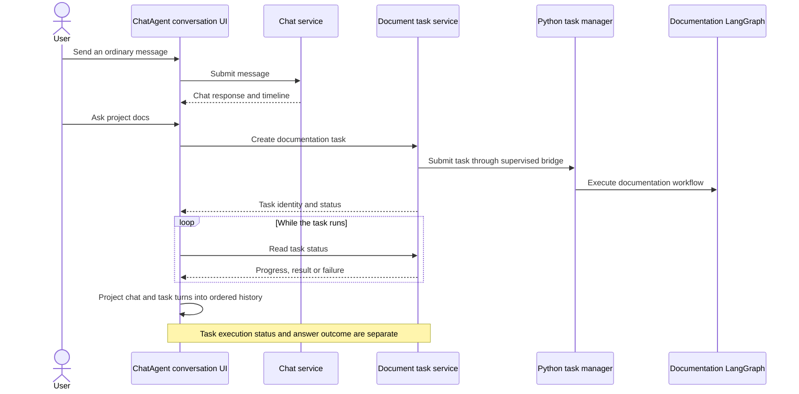
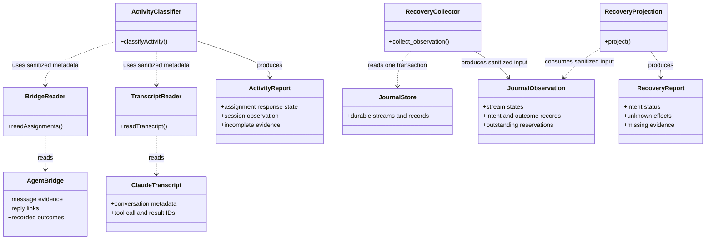
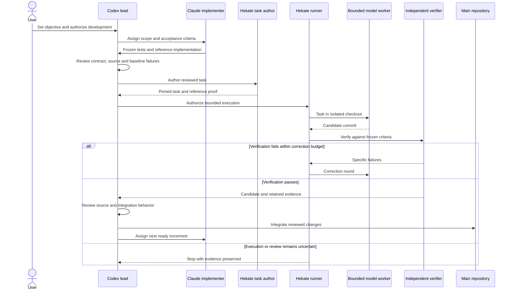
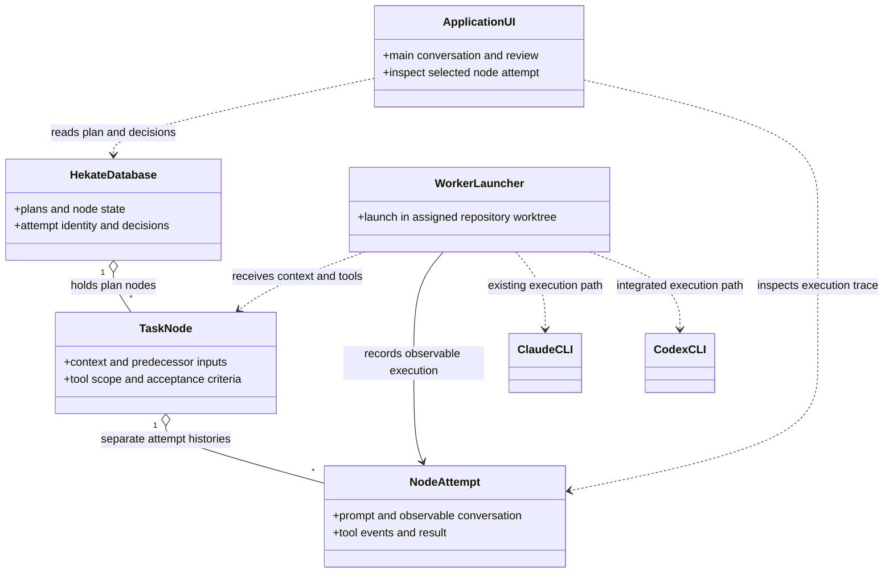
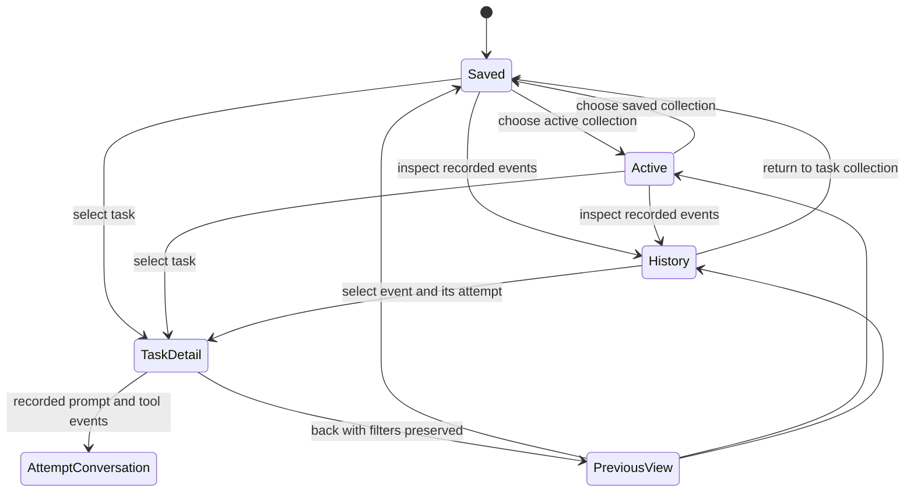
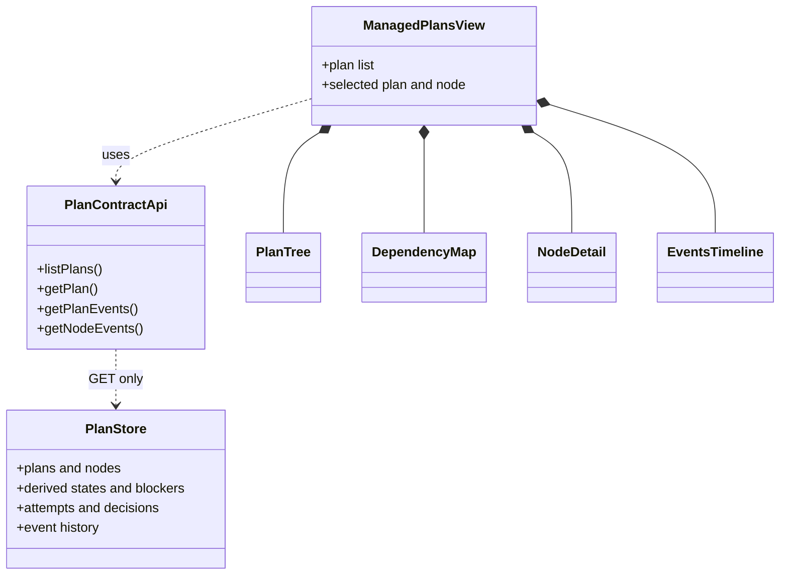
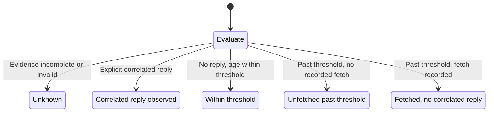

# ChatAgent and Hekate development architecture

ChatAgent provides the conversation UI and application runtime. Hekate provides
the supervised development runner and its durable execution evidence. The agent
bridge carries coordination messages between the development agents. These are
separate responsibilities: a delivered message does not prove execution, and a
successful worker test does not finish integration review.

Status on 2026-10-08: the UI history corrections, bridge readers and one-shot CLI
are integrated. The activity classifier is integrated: it is the accepted artifact
of a supervised worker task, verified against a frozen oracle. Hekate's resolution
guard, pure recovery projection and read-only journal collector library are
integrated. Recovery manifest publication, a collector CLI and automatic agent
resumption remain proposed work.
Hekate's prompt/stream capture, read-only trace endpoint, central attempt viewer
and Claude/Codex worker adapters are integrated at `1a3b6d9`. Both live README
rehearsals reached accepted state with verified traces. The Codex rehearsal
recorded shell startup failures; a worker PATH correction at `c063455` passed a
subsequent real shell-read and file-edit smoke. The
[roadmap](12-development-roadmap.md) records the evidence and remaining limits.

## Conversation and documentation execution

The documentation workflow can run asynchronously and return evidence and
citations. Its questions and results belong in the user's visible conversation,
even though tasks and chat events have separate stores. The UI orders task turns
by their persisted creation time so completion, reload and conversation switching
do not scramble the history. This documentation workflow is separate from
Hekate's development worker.

Sources: [conversation UI](../src/ui/homePage.ts),
[task history projection](../src/ui/documentTaskPanel.ts),
[chat service](../src/app/chatService.ts),
[Python task adapter](../src/app/documentTasks.ts),
[task supervisor](../src/app/documentTaskSupervisor.ts),
[Python task manager](../experiments/doc-agent/task_manager.py) and
[documentation graph](../experiments/doc-agent/graph_agent.py).

## Evidence readers and reports

This UML class diagram describes responsibility boundaries. The readers and
classifier are functions and modules, rather than service classes instantiated
at runtime.

The activity report answers whether a role recorded a reply explicitly correlated
with an assignment. A fetch or acknowledgement is delivery evidence, not proof
that a model read the assignment or is working. Transcript observations provide
corroboration, with incomplete or truncated input classified as unknown. The CLI
reads named assignments once; it does not resume agents or monitor in the
background.

The recovery report enumerates intents whose records remain available. An intent
is a recorded operation that may still need its outcome. A released reservation
does not prove the operation had no effects. Compacted records cannot be
enumerated, so the report marks that evidence incomplete. The pure projection
accepts caller-supplied sanitized observations and labels their hashes unverified;
it grants no recovery authority and performs no database or filesystem work.
The separate collector validates records through Hekate's existing bounded reader
in one read-only journal transaction. It returns sanitized input for the
projection, with a soft deadline and cancellation requests. It has no CLI or
manifest file writer, and it does not inspect PlanStore or prove that any worker
is currently executing.

Sources: [activity contract](implementation/15-stall-detection.md),
[bridge reader](../src/integrations/bridge/bridgeReader.ts),
[transcript reader](../src/integrations/bridge/transcriptReader.ts),
[classifier seam](../src/integrations/bridge/activity.ts) and
[one-shot CLI](../scripts/agentStalls.ts). Hekate sources are
`scripts/local/supervisor_e1/e1/evidence.py`, `durable.py`, `handoff.py` and
`recovery_manifest.py` and `recovery_collector.py` in the sibling repository.

## Supervised development execution

Frozen acceptance tests establish the required behavior before the worker starts.
The reference demonstrates that the task is satisfiable. Hekate bounds execution
and verifies the resulting candidate; the lead then reviews source and integration
behavior. The Windows identity task passed worker verification but still required
two helper corrections during integration review. A stopped run preserves its
uncertainty until a supported recovery path exists.

The development Claudes implement assigned increments. The bounded model worker
is a separate execution inside Hekate's supervised task runner. PlanStore holds
task state; the bridge carries messages and does not replace that store.

Sources: [development workflow](agent-bridge-development-workflow.md),
[Hekate integration contract](implementation/13-hekate-plan-node-integration.md)
and Hekate's `e1/task_author.py`, `task_runner.py`, `plan_run.py`, `pilot_real.py`
and `cli_worker.py` under `scripts/local/supervisor_e1/`.

## Headless node execution (product target)

Hekate executes Claude CLI and Codex CLI workers without VS Code, stores managed
plan state in its database, and exposes each attempt through the trace endpoint
and viewer. Both paths have completed a live README node rehearsal. The Codex
worker used its file-change tool while shell startup failed; its independent
verifier passed. Main-conversation hosting and application-driven plan launching
remain the product target. The PATH fix passed a bounded shell/file-edit smoke;
a full node rehearsal after the fix has not been repeated.

Each node starts with its own supplied context and tools. Outputs from earlier
nodes become explicit inputs to later nodes. Keeping attempts separate makes
retries inspectable without mixing conversations; it does not require an ongoing
chat for each repository. The trace describes observable messages and tool
activity, not private model reasoning. VS Code is an optional editor rather than
the worker host. Trace files are retained in the attempt run directory; PlanStore
holds their journal references and recorded integrity metadata. The read-only
endpoint resolves those references without storing raw conversation blobs in
PlanStore.

## Task navigation (implemented local increment)

The Tasks view gives stored work a common entry point across plans. List and
Board show the same filtered tasks; History shows recorded events and opens the
attempt that produced the selected event. This keeps navigation separate from
execution and makes older work accessible without recreating conversations.

Filters combine plan, text, status, review and readiness. List/Board share those
filters; History also filters event kind. Discovery and search cover loaded plan
pages, with explicit paging and refresh. Hekate's plan 049 specifies these
semantics and the remaining limits; this view does not launch or create tasks.

## Hekate plans browser (existing, read-only)

Hekate already has a local browser for managed plans
(`context-store/ui/src/components/ManagedPlansView.tsx`, Hekate plans 021 and 022).
It shows a plan's tree, dependency map, node detail and event history so a person can
see each node's readiness, attempts, blockers and decisions. Its API client
(`context-store/ui/src/planContract/api.ts`) only issues GET requests to PlanStore's
`/api/plan-contract/v1` endpoints, so it reads PlanStore's own derived state and
changes nothing.

This view is distinct from the static diagrams in this document and from evidence that
a worker is executing. It shows what PlanStore has recorded. A shared ChatAgent and
Hekate execution and bridge visualization remains proposed
([doc 13](implementation/13-hekate-plan-node-integration.md#proposed-shared-agent-and-task-visualization))
and is not implemented.

## Initial response classification

This is the reviewed classifier contract, which the integrated classifier
implements.

The classifier evaluates incomplete input first, then explicit correlation, then
age and delivery evidence. These states distinguish a delivery problem from a
missing recorded response without claiming that an agent is alive, stalled or
finished. Automatic resumption, escalation and detection of stalls after an
initial reply require later increments.
