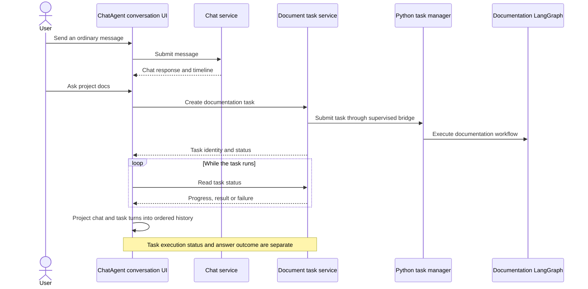
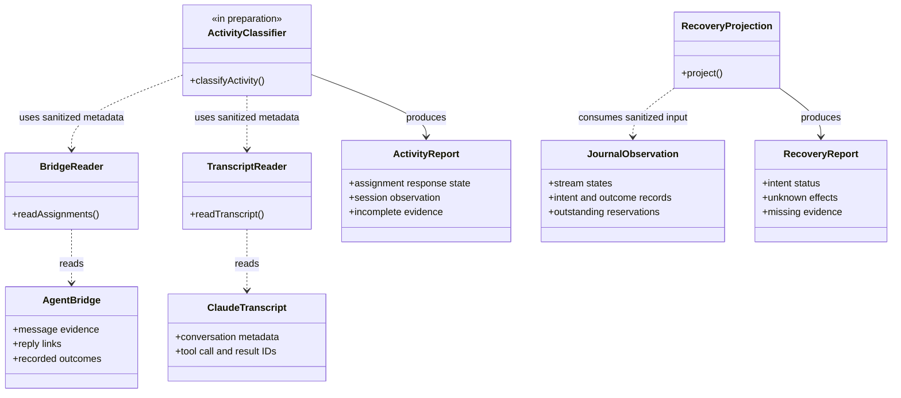
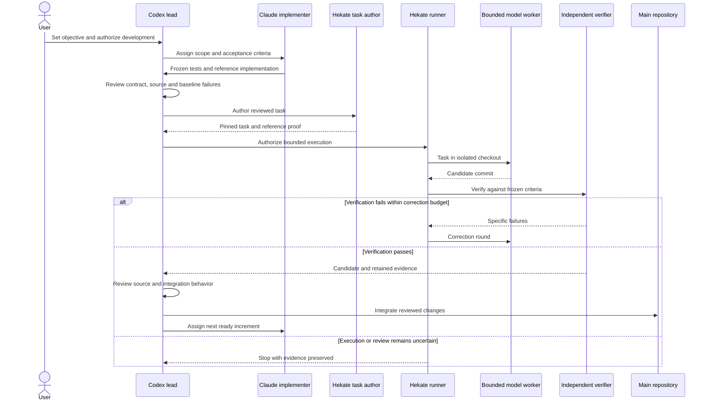
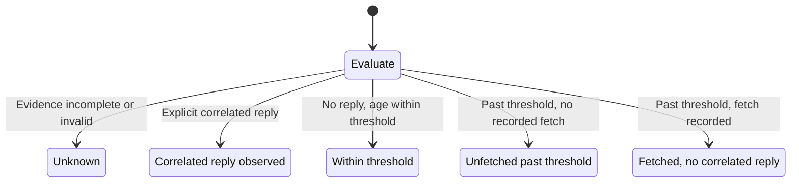

# ChatAgent and Hekate development architecture

ChatAgent provides the conversation UI and application runtime. Hekate provides
the supervised development runner and its durable execution evidence. The agent
bridge carries coordination messages between the development agents. These are
separate responsibilities: a delivered message does not prove execution, and a
successful worker test does not finish integration review.

Status on 2026-10-08: the UI history corrections, bridge readers and one-shot CLI
are integrated. The activity classifier is a conservative stub in main; its
reviewed reference is being prepared as a supervised task. Hekate's resolution
guard and pure recovery projection are integrated. Live recovery collection and
automatic agent resumption remain proposed work.

## Conversation and documentation execution

The documentation workflow can run asynchronously and return evidence and
citations. Its questions and results belong in the user's visible conversation,
even though tasks and chat events have separate stores. The UI orders task turns
by their persisted creation time so completion, reload and conversation switching
do not scramble the history. This documentation workflow is separate from
Hekate's development worker.

Sources: [conversation UI](../src/ui/homePage.ts),
[task history projection](../src/ui/documentTaskPanel.ts),
[chat service](../src/app/chatService.ts),
[Python task adapter](../src/app/documentTasks.ts),
[task supervisor](../src/app/documentTaskSupervisor.ts),
[Python task manager](../experiments/doc-agent/task_manager.py) and
[documentation graph](../experiments/doc-agent/graph_agent.py).

## Evidence readers and reports

This UML class diagram describes responsibility boundaries. The readers and
classifier are functions and modules, rather than service classes instantiated
at runtime.

The activity report answers whether a role recorded a reply explicitly correlated
with an assignment. A fetch or acknowledgement is delivery evidence, not proof
that a model read the assignment or is working. Transcript observations provide
corroboration, with incomplete or truncated input classified as unknown. The CLI
reads named assignments once; it does not resume agents or monitor in the
background.

The recovery report enumerates intents whose records remain available. An intent
is a recorded operation that may still need its outcome. A released reservation
does not prove the operation had no effects. Compacted records cannot be
enumerated, so the report marks that evidence incomplete. The pure projection
accepts caller-supplied sanitized observations and labels their hashes unverified;
it grants no recovery authority and performs no database or filesystem work.

Sources: [activity contract](implementation/15-stall-detection.md),
[bridge reader](../src/integrations/bridge/bridgeReader.ts),
[transcript reader](../src/integrations/bridge/transcriptReader.ts),
[classifier seam](../src/integrations/bridge/activity.ts) and
[one-shot CLI](../scripts/agentStalls.ts). Hekate sources are
`scripts/local/supervisor_e1/e1/evidence.py`, `durable.py`, `handoff.py` and
`recovery_manifest.py` in the sibling repository.

## Supervised development execution

Frozen acceptance tests establish the required behavior before the worker starts.
The reference demonstrates that the task is satisfiable. Hekate bounds execution
and verifies the resulting candidate; the lead then reviews source and integration
behavior. The Windows identity task passed worker verification but still required
two helper corrections during integration review. A stopped run preserves its
uncertainty until a supported recovery path exists.

The development Claudes implement assigned increments. The bounded model worker
is a separate execution inside Hekate's supervised task runner. PlanStore holds
task state; the bridge carries messages and does not replace that store.

Sources: [development workflow](agent-bridge-development-workflow.md),
[Hekate integration contract](implementation/13-hekate-plan-node-integration.md)
and Hekate's `e1/task_author.py`, `task_runner.py`, `plan_run.py`, `pilot_real.py`
and `cli_worker.py` under `scripts/local/supervisor_e1/`.

## Initial response classification

This is the reviewed classifier contract; main still contains the unknown-only
stub until the supervised task is verified and integrated.

The classifier evaluates incomplete input first, then explicit correlation, then
age and delivery evidence. These states distinguish a delivery problem from a
missing recorded response without claiming that an agent is alive, stalled or
finished. Automatic resumption, escalation and detection of stalls after an
initial reply require later increments.
