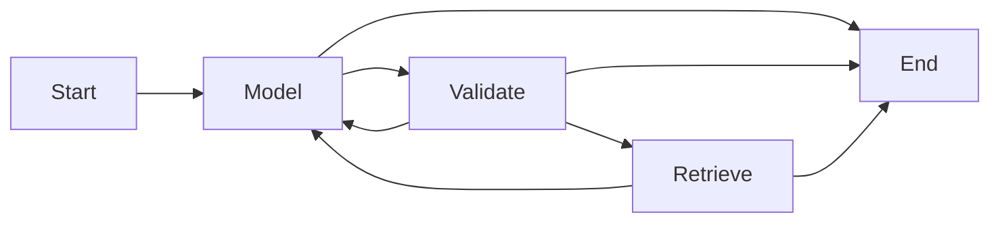

# The same agent as a LangGraph workflow

## 2026-09-27: durable single-task checkpoint

[SQLite pause/resume](DURABILITY.md) now supports process restarts from confirmed
retrieval pauses, preserving sources, evidence and budgets. 33 offline tests and
a four-process local Gemma4 run passed. This supersedes earlier descriptions of
persistence as entirely future work; the ordinary graph engine remains optional
and nonpersistent. Arbitrary in-flight crash replay is refused. The next increment
is task lifecycle/scheduling around this unit, with explicit long-pause policy.

`graph_agent.py` is an explicit StateGraph implementation using the installed
LangGraph 1.2.6. The original `agent.py` loop remains a reference implementation.
Select the graph with `--engine langgraph`; the CLI default remains `loop` so earlier
experiment commands retain their meaning. Both use the same prompt, tool schemas,
retrieval implementation and final-answer validator. Examples remain off unless
selected by the examples comparison; no on-demand example selector is implemented.



The model node invokes ChatOllama and records usage. Its finalizing mode disables
tools and supplies the constrained answer schema. Validation accepts a sourced
answer, requests the one allowed final synthesis, issues the existing retrieval
reminder, or chooses a terminal outcome. Retrieval executes the bounded structured
tools. Conditional edges inspect `route`; the model does not author graph edges.

`AgentState` carries messages, telemetry, model-call count, repeat detection,
finalization flags, sanitized response and result. Nodes return new list/set
containers and use default replacement semantics; there is no append reducer or
parallel writer. `node_trace` records execution separately from model-visible
messages, so tracing does not change the prompt or consume model tokens.

The graph's recursion limit counts execution super-steps, not model calls. It is
set above the maximum permitted node path; application limits still enforce six
model calls, eight tools, byte budgets and deadlines. There are no automatic node
retries that could bypass those budgets.

## Run and verify

```powershell
& D:\Git\LangChain\lca-lc-foundations\.venv\Scripts\python.exe experiments/doc-agent/run.py `
  --engine langgraph --model gemma4:26b --eval --out reports/doc-agent/my-graph-eval

& D:\Git\LangChain\lca-lc-foundations\.venv\Scripts\python.exe -m unittest discover `
  -s experiments/doc-agent -p "test_*.py"
```

The course environment already contained LangGraph; it was not modified. The
standalone requirements file now explicitly pins the version. Run metadata records
the engine, framework version and implementation hashes.

29 offline tests pass: the original 17, nine original agent contracts rerun against
the graph, and three additional tests for normalized request/event/result parity,
concurrent invocation isolation and propagation of cancellation. Parity compares
nine deterministic scenarios, excluding elapsed timings and graph-only trace fields.
This does not promise identical outputs from separate real-model invocations.

## Persistence boundaries (updated 2026-09-30)

The plain `--engine langgraph` command remains invocation-local by default: it
supplies no checkpointer, so a process restart loses its progress. This is a default
execution mode, not a limitation of LangGraph or the current graph implementation.

The earlier paragraph saying no checkpoint/resume interface existed described the
initial implementation and is now superseded. `graph_agent.py` accepts an optional
checkpointer, thread ID, resume flag and pause-before-retrieval setting. Graph state
now includes the source snapshot, retrieval counters/reads, issued evidence, model
call count and elapsed-budget state. Node entry restores retrieval working state;
retrieval updates are saved back to graph state. The model/tool objects themselves
are reconstructed in each process rather than serialized as live Python objects.

[The durable wrapper](DURABILITY.md) provides SQLite checkpoints and cross-process
resume from confirmed retrieval pauses. [The task manager](TASKS.md) adds task IDs,
lifecycle status and persisted cancellation. The standalone durable CLI counts
paused time against its wall-clock deadline; managed tasks use an active-time budget.
Both retain call/byte limits. A task killed while running is treated as uncertain
and is refused automatic replay: a checkpoint cannot by itself establish whether
an external model call or side effect completed before the crash.

For example, after three retrieval calls a resumed task must still have only its
remaining call allowance and the same document snapshot/evidence. Restoring only
chat messages would risk resetting the allowance or answering from changed files.
That is why durable state includes those dependencies, not just conversation text.

Cancellation testing confirms that cancelling the graph task cancels the fake
model await. It does not certify Ollama server-side resource release. The graph
preserves the original evidence-selection limitations; topology is not an accuracy
improvement. Graph execution remains in Python; the later optional
[conversation-task integration](../../docs/implementation/11-conversation-tasks.md)
connects it to chat through the task manager. This does not add Hekate integration.

References checked 2026-09-27: [official Graph API](https://docs.langchain.com/oss/python/langgraph/graph-api).
Model integration continues to follow the [reference guide](../../docs/14-model-reference-guide.md);
this increment changes execution structure, not the model's prompting or configuration.

Live validation: [four-case Gemma4 smoke report](../../reports/doc-agent/langgraph-findings-2026-09-27.md).
All structural checks passed; the unknown-cost answer retains its documented
absence-scope limitation.
